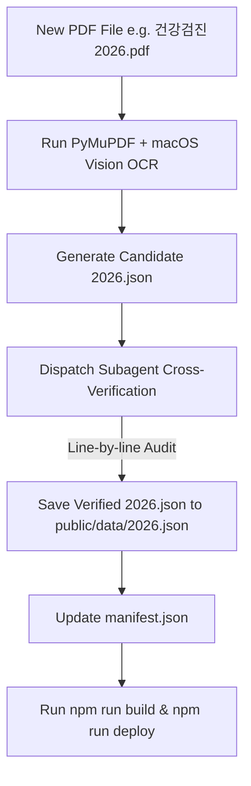

# Health Inspection Data Extractor & Verification Skill

This skill provides step-by-step instructions for extracting, cross-verifying, and publishing annual health inspection PDF reports (e.g. `건강검진2026.pdf`) into the Health Inspection Tracker Web Dashboard.

## Workflow Overview



---

## Step 1: Text & OCR Extraction

1. Use `PyMuPDF` (`fitz`) and macOS native `Vision` framework (`VNRecognizeTextRequest`) to extract accurate text from scanned PDF pages.
2. Run the extraction script:
   ```bash
   python3 scripts/extract_pdf.py --pdf /path/to/건강검진{YEAR}.pdf --year {YEAR}
   ```
3. The raw OCR output will be saved to `scratch/ocr_{YEAR}.txt`.

---

## Step 2: Formulate Candidate JSON (`data/candidate_{YEAR}.json`)

> [!IMPORTANT]
> **Exhaustive Extraction Page Mapping Rules (KMI Standard Format)**:
> - **계측검사**: Page 6/7 (키, 체중, BMI, 허리둘레, 혈압, 맥박수)
> - **당뇨검사**: Page 8/9. Extract **공복혈당** AND **HbA1c (당화혈색소)**.
> - **지질대사/심혈관**: Page 10/12 (총콜레스테롤, HDL, LDL, 중성지방)
> - **갑상선 기능 (필수)**: Page 13. Extract **TSH (갑상선자극호르몬)** AND **Free T4 (游離 갑상선호르몬)**.
> - **간기능**: Page 13/17 (AST, ALT, γ-GTP, 총단백, 알부민, 글로불린, A/G 비율)
> - **신장기능**: Page 14/18 (요소질소 BUN, 혈청 크레아티닌, e-GFR)
> - **혈액학**: Page 16/20 (혈색소 Hb, 백혈구수 WBC, 혈소판수, 요산 Uric Acid, hs-CRP)
> - **영양 & 전해질**: Page 21 (Na+ 나트륨, K+ 칼륨, Cl- 염소, Mg 마그네슘)
> - **종양표지자**: Page 22 (CEA, CA 19-9, AFP, PSA)
> - **안과/청력/안압/체성분**: Page 7, 26 (시력, 청력, 안압, 체수분, 체지방량 등)
> - **영상/기능검사**: Page 15, 16, 24, 25, 27 (심전도, 흉부 X-ray, 담낭 초음파, 전립선 초음파, 갑상선 초음파, 골밀도, 알레르기 107종)
> - **소변검사**: Page 15/19 (요단백, 요당, 요비중, 요 pH)

---

## Step 3: Subagent Cross-Verification (Anti-Hallucination)

> [!CRITICAL]
> **Subagent Audit Requirement**
> Always spawn an independent subagent (`invoke_subagent`) to audit every single numerical value, unit, reference range, and judgment string against `scratch/ocr_{YEAR}.txt`.

Command:
```json
{
  "Subagents": [{
    "TypeName": "research",
    "Role": "Health Data Cross-Verification Agent",
    "Prompt": "Cross-verify data/candidate_{YEAR}.json line-by-line against scratch/ocr_{YEAR}.txt. Check TSH, Free T4, HbA1c, tumor markers, and electrolytes. Report all discrepancies and output verified JSON to public/data/{YEAR}.json."
  }]
}
```

---

## Step 4: Publish & Update Manifest

1. Save verified JSON to `public/data/{YEAR}.json`.
2. Update `public/data/manifest.json`.
3. Test static site compilation (`npm run build`).
4. Deploy to GitHub Pages (`npm run deploy`).
